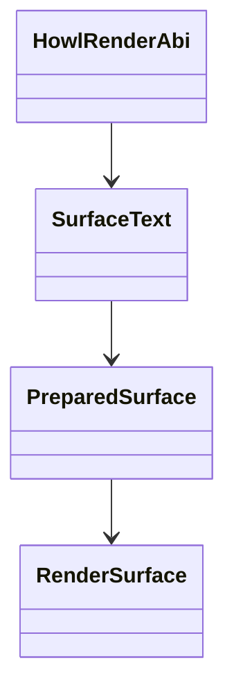
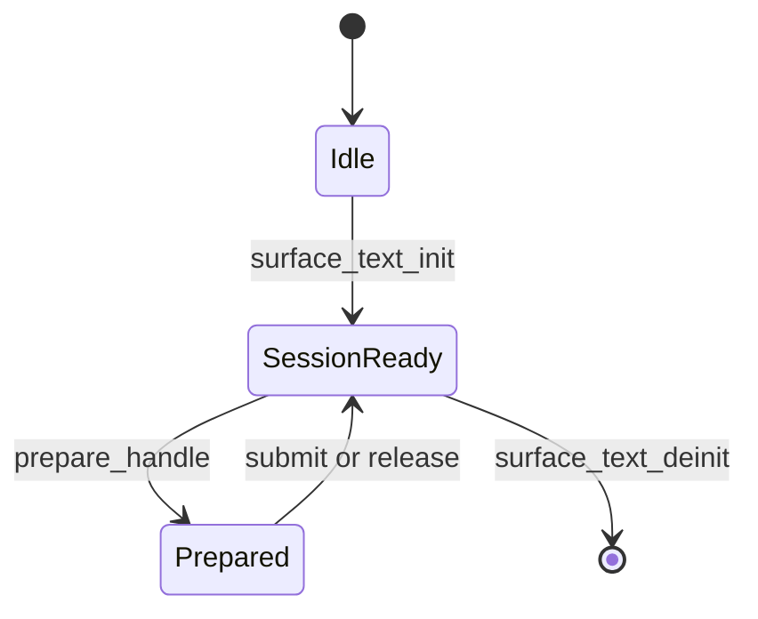
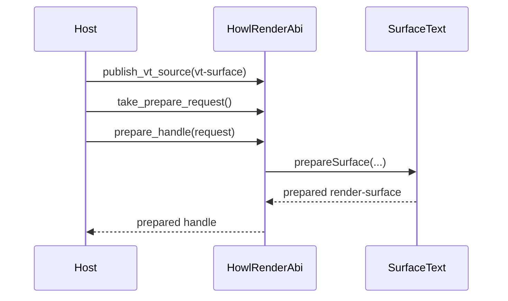
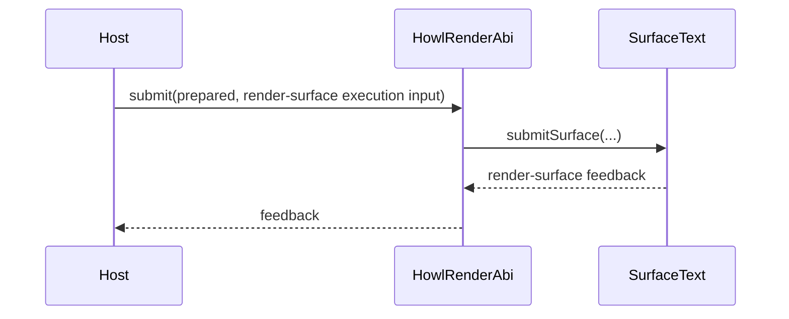

# Design

Shared rules: [`../design/design-rules.md`](../design/design-rules.md)

## Purpose

`howl-render` owns renderer-facing contracts and text rendering work for `howl-term`.

It consumes VT-surface input, derives render-surface work, and returns backend-agnostic prepared
output and submit feedback contracts. It does not own PTY behavior, VT semantics, host term-texture
resources, or platform presentation.

## Public Surface

- The only shipped embedding contract is `include/howl_render.h` plus `howl_render_*` exported
  symbols.
- `src/libhowl_render.zig` is the only public root that may export that contract.
- `src/howl_render.zig` is repo-local test and proof wiring only. It is not an embedding surface or a
  convenience integration boundary.
- `HowlRenderVtSurface` is the renderer-facing VT-surface input contract.
- `HowlRenderPreparedSurfaceHandle` and related `HowlRenderPreparedSurface*` structs are the
  prepared render-surface contract.
- `HowlRenderSurfaceHandle` is a generic host render target handle. It is not a concrete backend
  object such as a GL texture.
- Zig root imports are not an embedding surface and are not a preservation target.

## Ownership Rules

- `frame/surface.zig` owns render-surface contract types and prepared render-surface state.
- `frame/queue.zig` owns retained render-surface queue state, geometry epoch/query state, the
  render-owned publish-slot reserve/commit/cancel seam, one retained published VT-source packet per
  active prepare slot, VT snapshot publication classification, retained-base validation, and
  present retirement.
- `frame/surface_text.zig` owns prepare/submit text rendering work against VT-surface input, render
  session font config, fallback-font path copies, and text-state invalidation tied to that config.
- `frame/surface_text.zig` also owns the render-session allocator policy after init. The shipped C ABI
  chooses that allocator explicitly at the FFI seam instead of relying on hidden owner defaults.
- `frame/prepared_surface_owner.zig` owns prepared-surface handle state and the realized surface
  image exported through that handle.
- `frame/prepared_surface_ffi.zig` and `frame/surface_text_ffi.zig` translate the render contract to
  the shipped C ABI only.
- `howl-render` owns render-surface feedback, retained-base validation, and retained-frame logic.
- Hosts own concrete term-texture or backend resource creation, upload, and present.
- `howl-render` must not name or require concrete backend objects such as GL textures in its public
  contract.

## Lifecycle

## Main Flows

### VT-Surface To Prepared Render-Surface

### Host Execution To Render Submit

## API Contracts

- `howl_render_surface_text_init` and `howl_render_surface_text_deinit` own the opaque render
  session lifecycle.
- `HOWL_RENDER_MAX_FALLBACK_FONTS` is the header-declared fallback-font path limit for the public
  text-session configuration contract.
- primary font path plus fallback font paths form one ordered host-provided font list for the render
  session. Render copies that path state after intake, does not perform font discovery, and must see
  at least one usable font path before startup may proceed.
- `howl_render_surface_text_is_valid_font` reports whether the current ordered font list contains at
  least one usable font path for session startup.
- `HowlRenderVtSurface` carries VT-surface cells, cursor, viewport, dirty spans, and snapshot
  sequence truth into the render owner at publish time.
- `howl_render_surface_text_prepare_handle` consumes the exact render-owned published VT-source
  packet previously queued for that prepare token, returns a prepared render-surface handle only,
  and does not allocate or mutate host backend resources.
- the shipped C ABI currently binds render-owned session and prepared-surface allocations to the C
  allocator explicitly at the init/prepare seam. That allocator policy is part of the ABI
  translation step, not hidden owner behavior.
- `howl_render_surface_text_prepare_handle` consumes render-owned request state only. Hosts must not
  replay a second VT-surface copy into prepare as if it were independent authority.
- render retains the queued VT-source packet at the queue owner until that publication is retired or
  superseded. `prepare_handle` rejects a token that does not match the retained packet currently
  queued for prepare.
- `howl_render_surface_text_derive_frame_layout` is the public geometry-derivation entrypoint.
  Host-facing helpers that asked callers to provide `cell_px` are not part of the shipped contract.
- `howl_render_surface_text_sync_geometry` accepts only render and grid pixel constraints. It
  commits the render-owned derived layout; hosts must not feed `cell_px` back as competing truth.
- `howl_render_surface_text_sync_geometry` is the geometry-owner control step. The render owner
  advances geometry epoch, and prepare reads that owner state internally instead of exposing a host
  readback courier API.
- `howl_render_surface_text_publish_vt_source`, `...reserve_publish_slot`,
  `...commit_publish_slot`, `...cancel_publish_slot`, `...take_prepare_request`,
  `...publish_prepared`, `...take_submit_decision`, `...accept_submitted`, and
  `...retire_presented` are the retained render-queue control steps. They let hosts either publish
  one full VT source directly or reserve a render-owned publish slot, fill it in place from VT, and
  commit it without a second host-owned visible-surface allocation. VT publication must carry
  VT-owned visible projection truth, cells, cursor, and dirty spans so render can classify coarse
  damage itself from retained previous-frame state, instead of accepting host-authored damage
  classification or scrollback approximations.
- `howl_render_surface_text_pending_state` exposes render-owned work flags, including present
  retirement, so hosts can drive the queue without mirroring a second phase machine.
- `howl_render_surface_text_retire_presented` clears one render-owned present-pending frame and
  returns the VT `snapshot_seq` that the host must acknowledge through `howl_vt_terminal_ack_surface`.
- `howl_render_prepared_surface_buffer` is the realized surface-image export. Hosts consume it as
  one complete prepared surface image, not as a render-damage reconstruction contract.
- `howl_render_prepared_surface_diagnostics` exposes proof/debug counters only.
- `HowlRenderSurfaceExecutionInput` carries host execution truth back into render using a generic
  render-surface handle plus upload and timing facts.
- `HowlRenderSurfaceFeedback` reports the accepted render-surface handle and render metrics.
- Hosts and embedders consume this repo through the header and exported C ABI only.

## Non-Goals

- PTY or terminal parser behavior.
- Selection or scrollback semantics.
- SDL, OpenGL, Vulkan, Metal, or any other concrete host backend lifecycle.
- Window event loops or presentation cadence.

## Change Rules

- Keep the C ABI first in names, docs, and build roots.
- Preserve the split `VT-surface -> render-surface -> host term-texture`.
- Do not reintroduce concrete backend object names into the public render ABI.
- If host integration needs more data, sharpen the render contract instead of adding a Zig-shaped
  bypass.
